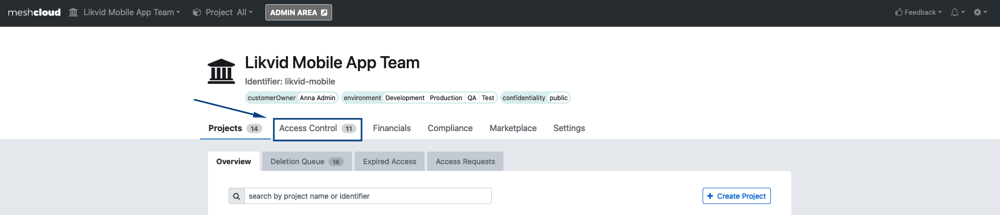
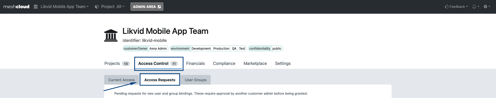

# Onboarding your team to your meshCustomer

`Customization hints:
In order to make the guide nicer for the users replace the general screenshot with a screenshot from your production environment to match the colours and options they see in the meshPanel while following the guide. Make sure that the tags required and used during the creation are explained either in this guide or in the description field in the meshPanel. Furthermore please consider any naming schemas for the name and identifier for a project.`

If you are not familiar with what a meshCustomer is, please check the [official meshcloud documentation](https://docs.meshcloud.io/docs/meshcloud.index.html).

## Pre-Requisites

- Permissions: Your user needs either the Customer Admin or Customer Owner role in the meshCustomer where you want to add further users

## :shoe: Step to Step Guide
1. Make sure you are in the meshCustomer you want to add further users. Do this by checking the drop-down in the upper-left corner.

2. Go to the access control panel by clicking on the `Access Control` tab

3. At the end of the `Current Access` list will be a input field. Type in the first-, last-name or email address to find and select the user you want to add. Choose a Customer Role (Customer Owner, Admin or Employee) and press the `+` button.

* Customer Owner can only be granted to max. 2 user per Customer. Also only a Customer Owner can grant another user the Owner role - except there is no Customer Owner at all.

### Optional
`Customization hints:
meshStack provides the optional configuration for 4-eyes access controls.
Please check the [official meshcloud documentation](https://docs.meshcloud.io/docs/meshcloud.customer.html#invite-users-to-a-meshcustomer-team).`

4. A second user with Customer Admin or Customer Owner permission needs to approve the access request. The second user must also navigate to the specific meshCustomer (see step 1.), go to the `Access Control` tab (see step 2.) and then click on the `Access Requests` tab in the second tab-row.
